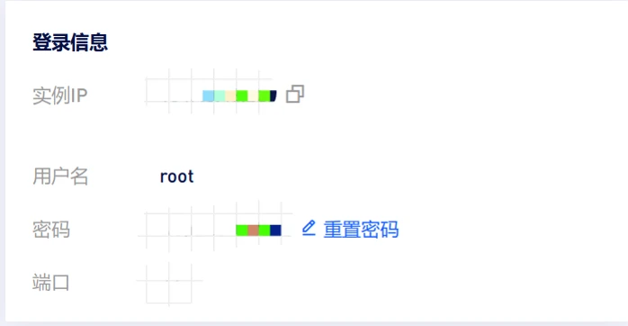
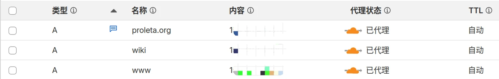

# 在本地构建你的网站

[Astro](https://astro.build/) 是一个比较新的前端框架，与其他框架相比减少了 JavaScript 的开销和复杂性，中文文档中如是说：

> 如果你需要一个加载速度快、具有良好 SEO 的网站，那么 Astro 就是你的选择。

你可以选择从零开始造轮子，磨练你的前端技能；当然，你也可以选择一个现有的主题，然后此基础上 DIY。例如我选择的是 [fuwari](https://github.com/saicaca/fuwari)，性能很好，而且简洁好看。可以修改源码来调整博客样式，这里就不赘述了。

首先 fork 一下原来的仓库，`fork` 相当于把别人的项目复制了一份。然后将你 fork 的仓库 clone 到你的本地。

如果你没有 `pnpm`，可以先安装 `npm install -g pnpm`。

在你的博客项目文件的根目录首先安装依赖，然后在本地仓库根目录进行构建

```shell
sudo pnpm install
pnpm build
```

这时静态网页文件就构建好了，构建好的网页文件即 `./dist`，可以在本地预览一下。在根目录打开终端，运行：

```shell
pnpm preview
```

当然也可以实时预览，这样在项目上的更改都能实时体现：

```shell
pnpm dev
```

写博客的时候把 `.md` 文档存放在 `src/content/posts` 即可，这个目录里面可以有任意子目录，写完之后 `pnpm build` 构建即可。

# 将博客部署至服务器

## \*使用 SSH 连接服务器

如果你对服务器的操作比较熟悉了，可以跳过这一小节。

首先确保已经购买了云服务器，我在这里不做任何服务商的推荐。打开服务器的 VNC：



例如公网 IP 是 `111.22.33.444` ，连接一下：

```shell
ssh root@111.22.33.444
```

之后我们会经常进入服务器，为了避免反复输入密码的麻烦，推荐使用 ssh 公钥私钥对。打开终端或者 Git Bash：

```bash
ssh-keygen -t ed25519 -C "myblog" -f ~/.ssh/blog_ed25519
```

`ed25519` 是基于椭圆曲线的现代加密算法，目前认为是非常安全和高效的。当然也可以使用经典的 `RSA` 这样的算法，使用时要注意指定合适的密钥位数来确保安全性。

建议使用新的密钥文件予以区分，例如 `~/.ssh/bolg_ed25519`。

不建议额外设置密码，使用 ssh 就是为了避免反复输入密码的麻烦，之后的内容直接 Enter 跳过即可。此时私钥创建在了 `blog_ed25519`，公钥（public key）创建在了 blog_ed25519.pub`。获取公钥内容：

```bash
cat ~/.ssh/blog_ed25519.pub
```

接下来把公钥放在服务器上即可：

```shell 
ssh root@111.22.33.444
```

进入 .ssh 文件，或者先创建。

```bash title = "Your VPS Terminal"
# 如果服务器不存在该目录，则需要新建
mkdir ~/.ssh

cd ~/.ssh
chmod 700 ~/.ssh
touch ~/.ssh/authorized_keys
chmod 600 ~/.ssh/authorized_keys
```

使用文本编辑器（如 `nano` 或 `vi`）打开 `authorized_keys` 文件，并将之前复制的**公钥**内容粘贴到新的一行。

```bash title = "Your VPS Terminal"
vi ~/.ssh/authorized_keys
```

`authorized_keys` 文件是一个纯文本文件，每一行包含一个公钥。每一行的格式是：公钥类型 - 公钥 - 注释。只要将 `.pub` 文件的内容一字不落的复制过去即可。

粘贴完成之后检查一下服务器的 `/etc/ssh/sshd_config`，确保公钥认证被允许。

```bash title = "Your VPS Terminal"
vim /etc/ssh/sshd_config
```

`sshd_config` 中要求这一行存在：

```text
<!-- /etc/ssh/sshd_config -->
PubkeyAuthentication yes
```

在服务器重启 ssh：

```bash title = "Your VPS Terminal"
sudo systemctl restart sshd
```

接下来可以尝试在本地连接一下服务器 `ssh -i ~/.ssh/blog_ed25519 root@111.22.33.444`，一般就可以直接连接了。 可以在本地配置 `config` 文件进一步简化，将参数更换为你需要的即可。

```text
<!-- ~/.ssh/config -->
Host myblog
HostName 111.22.33.444
User root
IdentityFile ~/.ssh/blog_ed25519
Port xx
```

下次连接服务器只需要：

```bash
ssh myblog
```

## 利用 Nginx 部署静态网页

### 上传静态文件

Nginx 是一款轻量级的 Web 服务器/反向代理服务器，特点是占有内存少，并发能力强。首先在服务器上安装并启动 Nginx：

``` bash title = "Your VPS Terminal"
sudo apt update
sudo apt install nginx
sudo systemctl start nginx
```

在服务器上创建一个目录来存放静态网页文件，目录的位置视需求而定，最好使用绝对路径。

```bash title = "Your VPS Terminal" 
sudo mkdir -p /websites/myblog
```

在本地机器上执行 `scp` 命令来上传文件。在上一小节中设置了SSH，可以将用户名和服务器公网IP替换成你设置好的名称。

```bash
scp -r /path/to/your/local/website/dist/* myblog:/websites/myblog
```

### 配置 Nginx 服务器

进入服务器的 Nginx 配置目录，我的服务器系统为 Ubuntu，则目录为 `/etc/nginx/sites-available/`。然后创建一个新的配置文件。配置文件的名称随意。

```bash title = "Your VPS Terminal" 
sudo vi /etc/nginx/sites-available/blog.conf
```

下面给出一个配置文件的简单示例，可以根据你的需求来改。

```nginx
server {
    listen 80; # 监听 80 端口，用于 HTTP 访问
    listen [::]:80; # 监听 IPv6 地址

    server_name apple.xyz www.apple.xyz; # 你的域名和/或服务器IP
    
    # 网站文件的根目录，这里指向你上传静态文件的位置
    root /websites/myblog;
    
    # 默认索引文件，Nginx 将按顺序查找这些文件
    index index.html index.htm;

    location / {
        # 尝试查找对应的文件或目录，如果找不到则返回 404
        try_files $uri $uri/ $uri.html =404;
    }
    
    # 可选：自定义错误页面
    error_page 404 /404.html;
    location = /404.html {
        internal;
    }
}
```

有几个地方需要特别说一下：第一， `root` 不支持相对路径，需要换成绝对路径；第二是如果你自己设计了404页面，可以按上面这样配置成你自己的；第三点，需要在 DNS 服务器的提供商中添加 A 记录，否则只能通过公网 IP 访问你的网页。



例如在图中，这些域名和子域名都解析到了我的服务器：`proleta.org` , `www.proleta.org`, `wiki.proleta.org`。

接下来创建软链接来启用配置：

```bash title = "Your VPS Terminal"
sudo ln -s /etc/nginx/sites-available/blog.conf  /etc/nginx/sites-enabled/
# 禁用默认的配置
sudo unlink /etc/nginx/sites-enabled/default
```

重新加载 Nginx 之前需要检查一下语法：

```bash title = "Your VPS Terminal"
sudo nginx -t
```

配置语法正确，重新加载服务即可。

```bash title = "Your VPS Terminal"
sudo systemctl reload nginx
sudo systemctl restart nginx
```

一般情况下 VPS 会拒绝 port 22 外的其它请求，需要开启防火墙允许 port 80 和 port 443，分别对应 HTTP 和 HTTPS。

```bash title = "Your VPS Terminal"
sudo ufw enable
sudo ufw allow 22
sudo ufw allow 80
sudo ufw allow 443
```

检查一下防火墙配置：

```bash title = "Your VPS Terminal"
sudo ufw status verbose
```

到此为止，应该就可以通过域名访问你的静态博客网页了。

### 配置 SSL 证书

SSL 让网址从 `http://` 变为 `https://`，并在浏览器地址栏显示一个安全图标，还是建议配置一下。首先在服务器安装 Certbot，参见[官方文档](https://certbot.openssl.ac.cn/instructions?ws=nginx&os=snap&commit=%3E)。我们使用 snapd 进行管理。

```bash title = "Your VPS Terminal"
sudo apt update
sudo apt install snapd
sudo snap install --classic certbot
sudo ln -s /snap/bin/certbot /usr/bin/certbot
```

自动配置 nginx 文件即可。 

```bash title = "Your VPS Terminal"
sudo certbot --nginx
```

或者，如果只想获取证书，然后手动配置 `/etc/nginx/sites-available/blog.conf`：

```bash title = "Your VPS Terminal"
sudo certbot certonly --nginx
```

> 以上。

